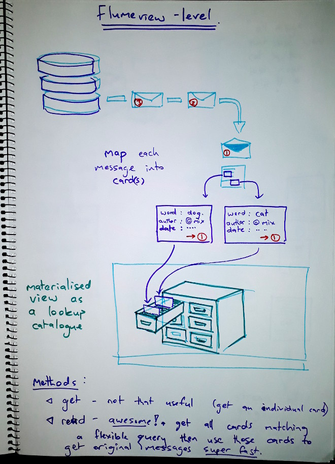

# Intermediate

---

## Flumeview-level
We'll learn how to create a [flumeview-level](http://github.com/flumedb/flumeview-level) to create a queryable data subset of our core scuttlebutt database.
We'll also learn how to use [bytewise](http://npmjs.com/package/bytewise) to write queries for our level view

Flumeview-level | Example
:-----------------------------------:|:-----------------------------------:
 | 

**%%TODO%%**:
* Write more about flumeview and add links
* Add @mix's cool pictures

### Exercise 1
* Build out a flumeview-level to create a leveldb
* Leveldb acts as a subset of our scuttlebutt database

## Bytewise Queries

### Exercise 2
* Write a series of bytewise queries

## Combine your knowledge!

### Exercise 3
* Optimise your flumeview-level with a some queries
